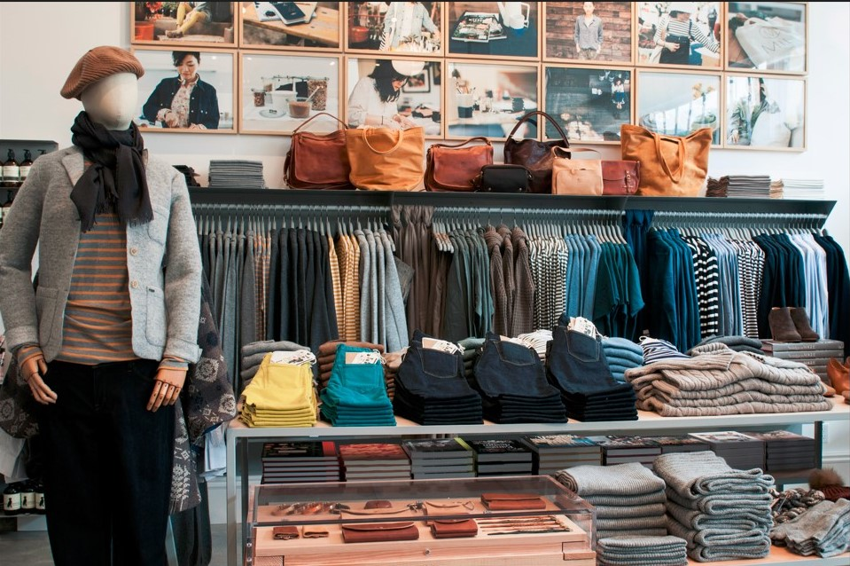
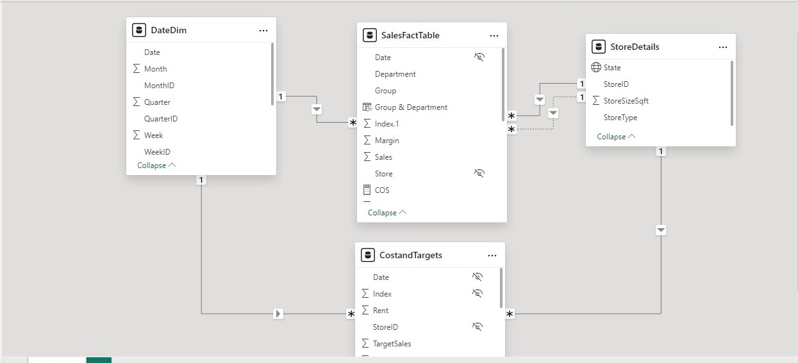
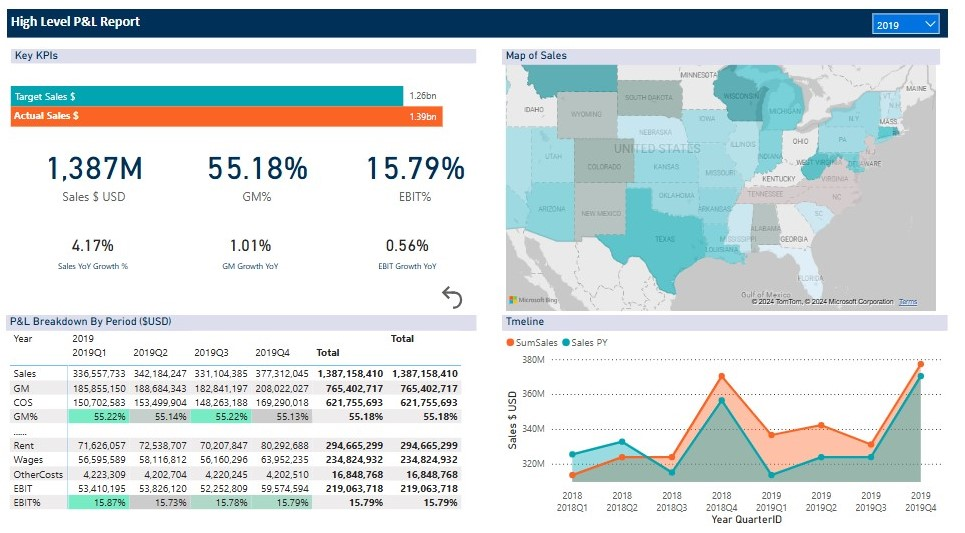
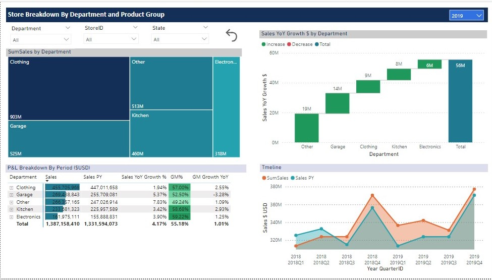
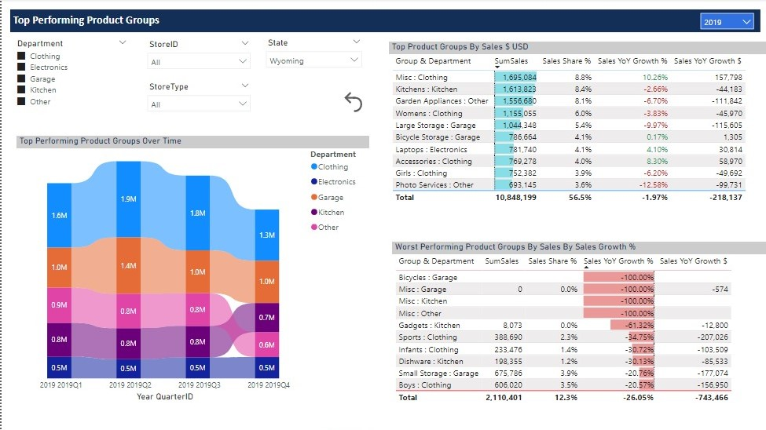
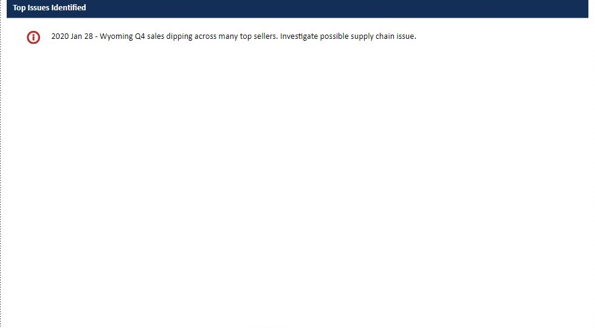

# High Level P&L Report

### Introduction
This is a power BI project on sales,profit and loss analysis of an imaginary retail store. The project is to analyze and generate insights to answer critical questions that will help the store make data driven decisions.

### Data Sources
The primary dataset used for this analysis is the “sales_retail.csv” (2017 -20191) file, containing detailed information about the sales made by the retail store.
**_Disclaimer_** : _All datasets and reports do not represent any company, institution or country, but just a dummy dataset to demonstrate capabilities of Power BI. as provided by Corporate Finance Institute (CFI)._

### Problem Statement
1.	What is the performance in sales and growth/decline in profit per year?
2.	Which department of the store has high impact on income?
3.	Which product group is performing better or worse?

### Skills/concepts demonstrated
The following Power BI features were incorporated:
•	Bookmarking
•	DAX
•	Quick measures
•	Modelling
•	Filters
•	Tooltips
•	Button

### Modelling
Automatically derived relationships are adjusted to remove and replace unwanted relationships with the required.
Adjusted model                   
:---------------------------------:

The model is a star schema.
There are 3-dimensional tables and 1 fact table. The dimension tables are all joined to the fact table with a one-to-many relationship.

### Visualization
The report comprises of 4 pages
1.	High Level View
2.	Store View
3.	Top Performng Product Group
4.	Top Issues
You can interact with the report [here](https://app.powerbi.com/groups/me/reports/0db28b16-0f77-417f-b399-96ef6b2be7e9/ReportSection?experience=power-bi)

#### Features:

Hierarchies - to enable drill down.

Reset - the button to clear all filters.

Bookmarks - to allow users to actively click, hover and engage.

#### High Level View

The retail store currently has a total sum of $1,387 millon (USD) in sales, with 55.18% GM% (Gross Margin percent) and 15.23% EBIT% (Earning Before Interest and Taxes percent) respectively.
The store has a total of 40 core, digital and core store type spread across the USA.

#### Store View

The top 5 Departments in the store are Clothing, Garage, Other, Kitchen, and Electronics. 
The Sales YoY% (Year over Year percent) shows that Clothing, Garage and Electronics department performed better the previous year.

#### Top Performing Product Group

The top 10 selling product group are from 5 departments while the 10 worst performing product group are from 4 departments.
The 2nd quater of 2019 recorded the highest sales and followed by a decline in the 3rd and 4th quarter. 

#### Top Issues

The store in Wyoming should be investigated to know the possible causes of dip in sales across top selling products.

### Conclusion:
West Virginia has the highest impact on income followed by Texas and Washington.

### Recommendation:
For a deep dive into the analytics, the datasets of the previous years will be required for comparison, patterns and better understanding.

